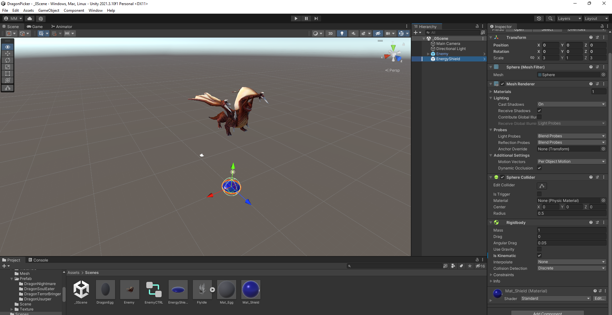
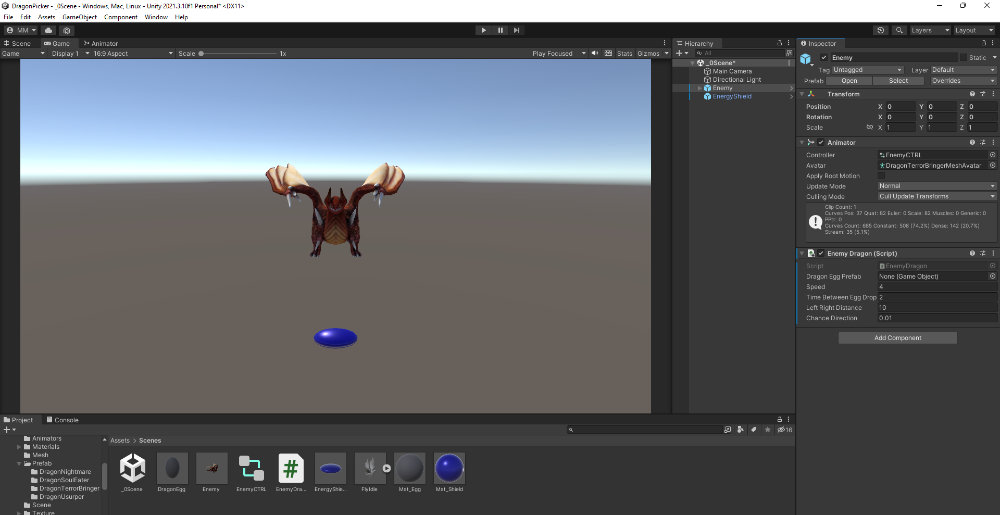
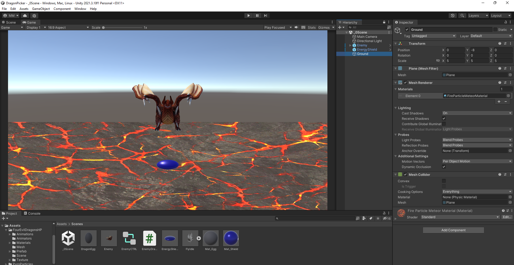
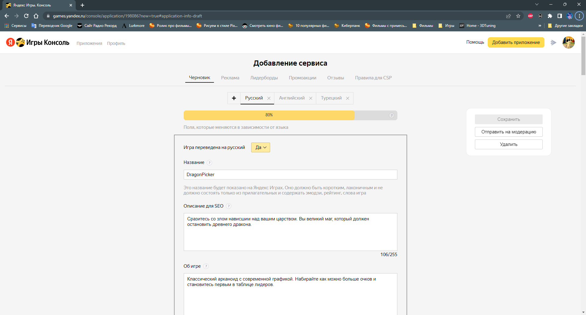
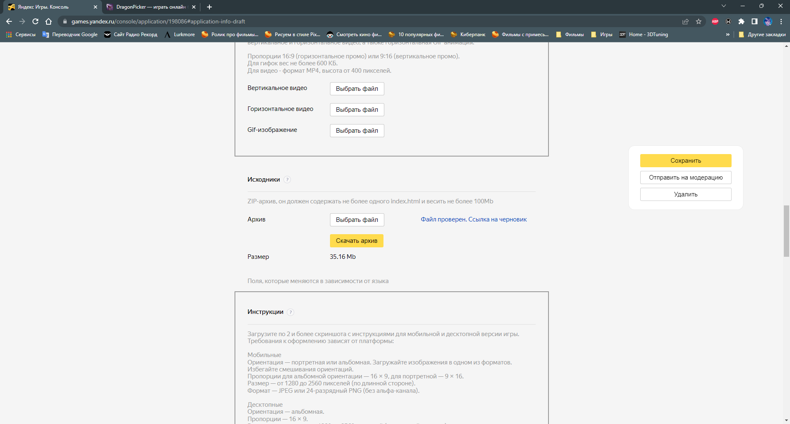
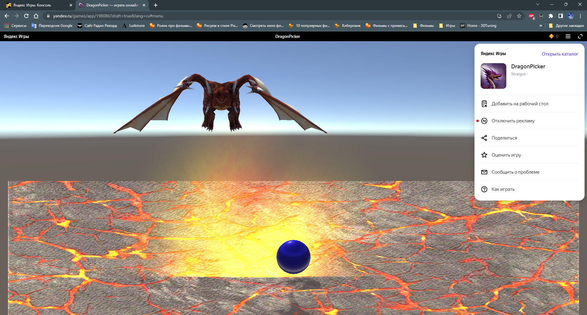

# РАЗРАБОТКА ИГРОВЫХ СЕРВИСОВ
Отчет по лабораторной работе #2 выполнил(а):
- Мишуров Максим Игоревич

Отметка о выполнении заданий (заполняется студентом):

| Задание | Выполнение | Баллы |
| ------ | ------ | ------ |
| Задание 1 | * | 60 |
| Задание 2 | * | 20 |
| Задание 3 | * | 20 |

знак "*" - задание выполнено; знак "#" - задание не выполнено;

Работу проверили:
- к.т.н., доцент Денисов Д.В.
- к.э.н., доцент Панов М.А.
- ст. преп., Фадеев В.О.

[](https://nodesource.com/products/nsolid)

[](https://travis-ci.org/joemccann/dillinger)

Структура отчета

- Данные о работе: название работы, фио, группа, выполненные задания.
- Цель работы.
- Задание 1.
- Код реализации выполнения задания. Визуализация результатов выполнения (если применимо).
- Задание 2.
- Код реализации выполнения задания. Визуализация результатов выполнения (если применимо).
- Задание 3.
- Код реализации выполнения задания. Визуализация результатов выполнения (если применимо).
- Выводы.
- ✨Magic ✨

## Цель работы
Создание интерактивного приложения и изучение принципов интеграции в него игровых сервисов.

## Задание 1
### По теме видео практических работ 1-5 повторить реализацию игры на Unity. Привести описание выполненных действий.

Ход работы:
В ходе практической работы 1 импортировал дракона, добавил его на сцену, создал префабы яйца и щита.  



Далее настроил камеру и добавил скрипт полета дракона, с анимацией.
```c#
using System.Collections;
using System.Collections.Generic;
using UnityEngine;

public class EnemyDragon : MonoBehaviour
{
    public GameObject dragonEggPrefab;
    public float speed = 1;
    public float timeBetweenEggDrops = 1f;
    public float leftRightDistance = 10f;
    public float chanceDirection = 0.1f;
    void Start()
    {
        
    }

    void Update()
    {
        Vector3 pos = transform.position;
        pos.x += speed * Time.deltaTime;
        transform.position = pos;

        if (pos.x < -leftRightDistance){
            speed = Mathf.Abs(speed);
        }
        else if (pos.x > leftRightDistance){
            speed = -Mathf.Abs(speed);
        }
    }

    private void FixedUpdate() {
        if (Random.value < chanceDirection){
            speed *= -1;
        }
    }
}
```


Затем добавил пол и настроил текстуры.



И в конце прописал скрипт для уничтожения яйца при падении.
```c#
using System.Collections;
using System.Collections.Generic;
using UnityEngine;

public class DragonEgg : MonoBehaviour
{
    public static float bottomY = -30f;
    void Start()
    {

    }

    private void OnTriggerEnter(Collider other) {
        ParticleSystem ps = GetComponent<ParticleSystem>();
        var em = ps.emission;

        Renderer rend;
        rend = GetComponent<Renderer>();
        rend.enabled = false;
    }

    void Update()
    {
        if (transform.position.y < bottomY){
            Destroy(this.gameObject);
        }
    }
}
```


И переписал код для генерации энергитического щита при старте игры.

```c#
using System.Collections;
using System.Collections.Generic;
using UnityEngine;

public class DragonPicker : MonoBehaviour
{
    public GameObject energyShieldPrefab;
    public int numEnergyShield = 3;
    public float energyShieldBottomY = -6f;
    public float energyShieldRadius = 1.5f;

    void Start()
    {
        for (int i = 1; i <= numEnergyShield; i++){
            GameObject tShieldGo = Instantiate<GameObject>(energyShieldPrefab);
            tShieldGo.transform.position = new Vector3(0, energyShieldBottomY, 0);
            tShieldGo.transform.localScale = new Vector3(1*i, 1*i, 1*i);
        }
    }

    void Update()
    {
        
    }
}
```
В завершении задания заполнил черновик на YandexGames



## Задание 2
### В проект, выполненный в предыдущем задании, добавить систему проверки того, что SDK подключен (доступен в режиме онлайн и отвечает на запросы);

Ход работы: 
1. Качаю PluginYG, импортирую в проект.
2. Добавляю объект YandexGame на сцену.
3. Билдим проект WebGL с пресетом PluginYG.
4. Архивирую и загружаю в черновик на YandexGames.
5. Файл проверен, можно запускать.

7. Как видим, sdk подключился и доступны все функции.
 

## Задание 3
### 1 Произвести сравнительный анализ игровых сервисов Яндекс Игры и VK Game;  
### 2 Дать сравнительную характеристику сервисов, описать функционал;  
### 3 Описать их методы интеграции с Unity;  
### 4 Произвести сравнение, сделать выводы;  
### 5 Подготовить реферат по результатам выполнения пунктов 1-4 .

Ход работы: Изучил оба сайта, составил сравнительную характеристику, описал методы интеграции с Unity и сделаные выводы оформил в документ.
[Ссылка на документ.](https://docs.google.com/document/d/1L3V8Yr3ABv4WDAtvBw7-vCL5dj4CwzFt-lbwOJDr85w/edit?usp=sharing)

## Выводы

Познакомился с YandexGames, узнал чем они лучше VKGames. Создал и сбилдил первое приложение на юнити.

| Plugin | README |
| ------ | ------ |
| Dropbox | [plugins/dropbox/README.md][PlDb] |
| GitHub | [plugins/github/README.md][PlGh] |
| Google Drive | [plugins/googledrive/README.md][PlGd] |
| OneDrive | [plugins/onedrive/README.md][PlOd] |
| Medium | [plugins/medium/README.md][PlMe] |
| Google Analytics | [plugins/googleanalytics/README.md][PlGa] |

## Powered by

**BigDigital Team: Denisov | Fadeev | Panov**
